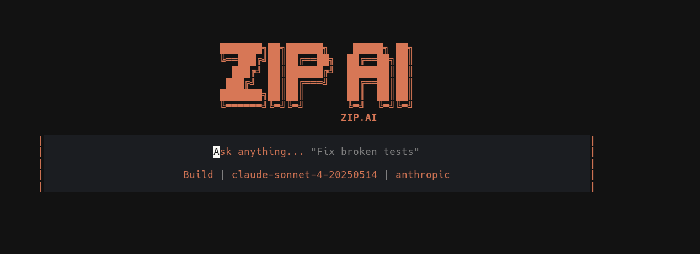

# Zip AI

<p align="center">
  
</p>

Token-efficient AI CLI using DOT format with built-in token limits and Simplified Chinese output.

## Architecture

The project is structured as pure ESM Node.js modules without heavily relying on external frameworks:

- **`bin/zipai.js`**: CLI entry point.
- **`src/dot.js`**: DOT format encode/decode logic (zero external dependencies).
- **`src/tokens.js`**: Token counting and budget enforcement (uses lazy-loaded tiktoken).
- **`src/config.js`**: Configuration loading (flags > `.zipai` > `~/.zipairc` > environment variables > defaults).
- **`src/client.js`**: Anthropic API wrapper (the only module importing the SDK).
- **`src/files.js`**: Handling file reading and truncation.
- **`src/repl.js`**: Interactive REPL state and input processing.

## Features

- **Token-Efficient**: Uses a proprietary DOT format encoding for prompts to minimize token usage compared to standard JSON or Markdown.
- **Interactive REPL**: A responsive chat interface for ongoing conversations with the AI.
- **File Mastery**: Built-in commands to review, fix, explain, and refactor local files directly from the CLI.
- **Resource Constraints**: Built-in session token budgets and limits to prevent unexpected API costs.
- **Session Management**: Resume and manage conversations across different sessions.
- **Multi-Provider Support**: Supports Anthropic (default) and extendable to others via runtime inferring or plugins.

## Installation

You can install `zipai` globally using npm:

```bash
npm install -g zipai
```
*(Or clone this repository and use `npm link`)*

## Configuration

Set your default provider and API key before using the tool:

```bash
zipai providers --set anthropic
zipai providers --key "YOUR_API_KEY"
```

Configuration is stored in `~/.zipairc` globally, or you can place a `.zipai` file in your local directory for project-specific settings.

You can view and modify configuration via:
```bash
zipai config
zipai config --set lang=en
```

## Usage

### Interactive Chat
Start an interactive chat session:
```bash
zipai
```

### One-shot question
Ask a single question and get a response immediately:
```bash
zipai ask "how do I use git rebase?"
```

### File Operations
Attach a file as context or ask the AI to perform specific tasks on a file:

- **Review a file**:
  ```bash
  zipai file src/app.js
  ```
- **Explain what a file does**:
  ```bash
  zipai explain src/app.js
  ```
- **Fix bugs in a file**:
  ```bash
  zipai fix src/app.js
  ```
- **Refactor a file**:
  ```bash
  zipai refactor src/app.js
  ```

### Advanced Usage

- **Compare token cost**: Understand the savings of DOT format vs JSON or Markdown.
  ```bash
  zipai bench "explain this code" -f src/app.js
  ```
- **Session management**:
  ```bash
  zipai session list
  zipai session new "my task"
  zipai session switch <session_id>
  ```
- **Providers and Models**:
  ```bash
  zipai models
  zipai switch-model claude-3-5-sonnet-20241022
  ```

## Development

The project is structured as pure ESM Node.js modules without heavily relying on external frameworks. 

- **Run tests**:
  ```bash
  npm test
  ```
- **Available skills**:
  ```bash
  zipai skills
  ```

Check out the `specs/` directory for module specifications and `CLAUDE.md` / `CONSTITUTION.md` for project principles.
